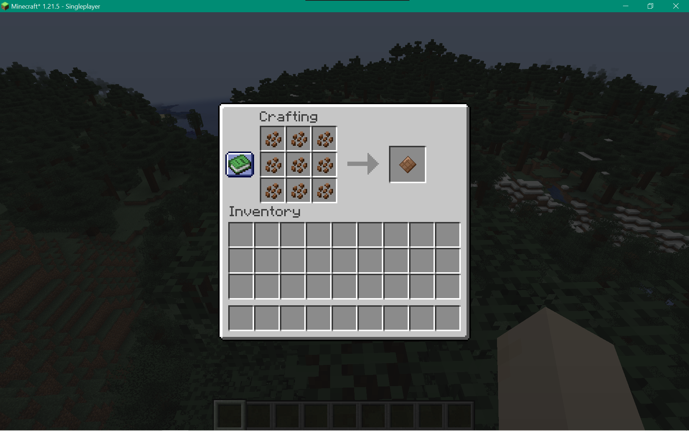

# CHOCO
Minecraft is missing a crucial food item, guess what it is.
Chocolate! The snack that we all love! This mod allows you to 
craft chocolate taste the greatness of chocolate even in minecraft.

This is my first Minecraft mod and my first Java Project, please don't
judge my bad syntax and programming skills.

## Crafting
Chocolate is very easy to craft. It takes nine cocoa beans in this
configuration in the crafting table:

## Consumption
By consuming chocolate you will restore hunger at one point and
get an absorption effect. It will take you one second or 20 game
ticks to consume one chocolate.

## Composting
Chocolate has a 30% chance of increasing a composter's level by 
one.